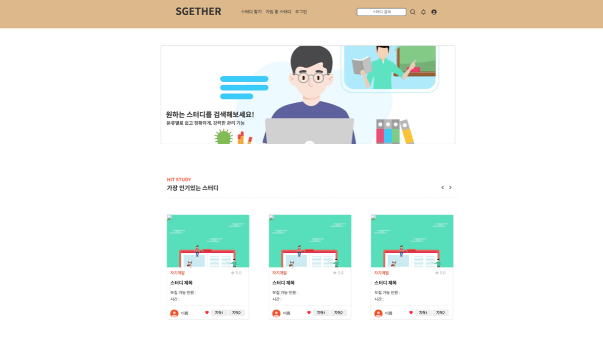
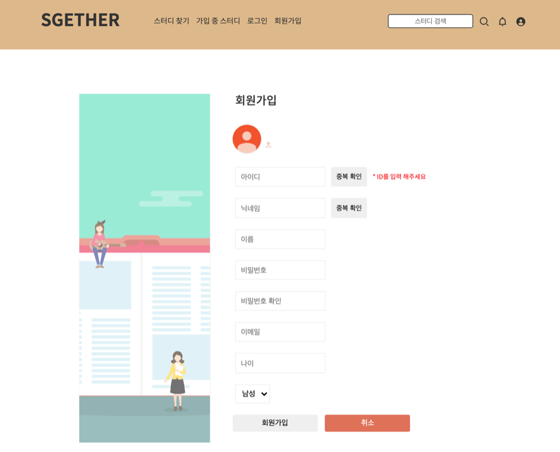
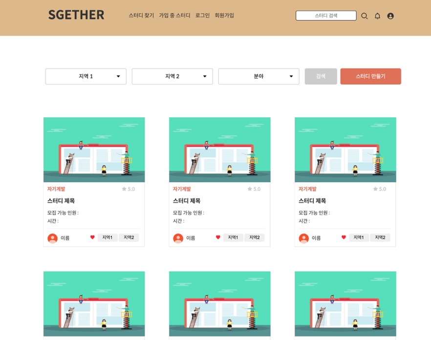
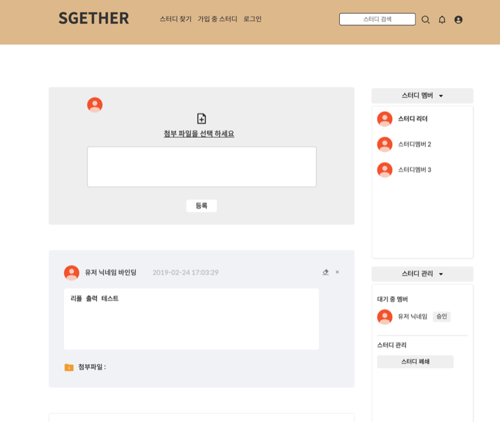

# SGETHER

> 나에게 딱 맞는 스터디그룹 검색 사이트

---
### **`정보`**

1. 프로젝트 요약  
  * 기존 카페나 오픈채팅 등을 통해서 진행되어 왔던 스터디그룹 모집 및 커뮤니티를 편리하게 웹사이트에서 진행할수 있도록 함  
    지역별 / 분류별로 원하는 스터디 그룹을 서치하고 참여할수 있으며, 게시물 작성 및 파일 공유 기능을 지원

2. 사용기술 : HTML, CSS, JAVA, Spring, JavaScript, Mybatis, Oracle DB      

---  
### **`구현기능`**

1. **Front-End (해당 프로젝트에서는 Front-End 파트만 담당 하였습니다)** 
  * 웹페이지 레이아웃 설계 및 스타일링 작업
  * 회원정보 및 게시물 유효성 검사
  * 동적 웹사이트를 위한 UI 구현   

2. **Back-End** 
  * 회원가입, 수정, 탈퇴
  * 로그인 / 로그아웃
  * 스터디 알람
  * 스터디 찾기 / 리스트
  * 스터디 생성 / 상세보기
  * 리뷰 작성 / 수정 / 삭제
  * 리뷰 평점 기능
  * 스터디 스크랩
  * 공유파일 업로드 및 다운로드
---
### **`구현화면`**

* **회원 가입**

* **스터디 리스트 (검색, 생성)**

* **스터디 포스트 (파일 공유 / 스터디 관리)**

